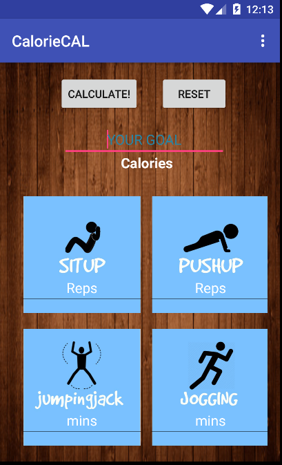

# PROG 01: Crunch Time - 

The app "CalorieCal" calculates the amount of work you need to do in order to burn the desired calories you entered. The included types of exercise are situp, jumpingjack, pushup, and jogging. The app also allows you to do conversions between the four types of exercise. 

To set the goal calorie, enter the number of calories you wish on the top and click on "Calculate". The app will automatically generate the amount of work you need to do for each exercise. 

To see the conversion between different exercises, first click on the "Reset" button to reset all the fields. Then, enter how long (in minutes) or reps you've done for the exercise and then click on "Calculate". Again, the app will do an automatic conversion to the other three exercises. 

In order to switch from goal setting and conversion between different exercises, click on the "Reset" button to reset all the fields. 
Failure to reset before doing a new set of calculation will result in an error message - " Only fill in one field. Click on the RESET button to continue"

You must alway enter one field of the app to do the calculations. Attempts on calculating without entering any number to any field will result in an error message - "Please enter at least one field to calculate"

## Authors

Jennifer Hsu ([jwhsu@berkeley.edu](mailto:jwhsu@berkeley.edu))

## Demo Video

See [CS160 CrunchTime Project - CalorieCAL ] (https://www.youtube.com/watch?v=sP94UgczirE&feature=youtu.be)

## Screenshots

## Acknowledgments

